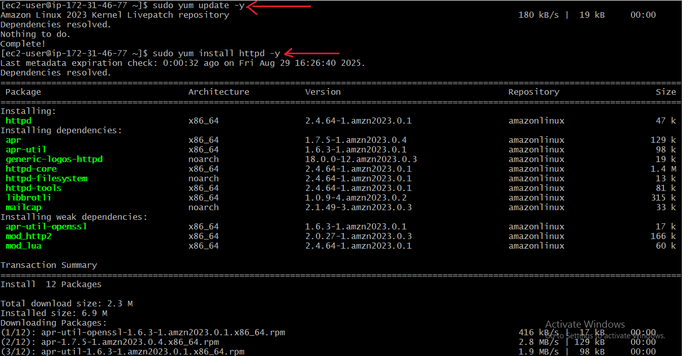

# Static Website Deployment On Amazon Linux Using HTTPD

### A simple, step-by-step guide to deploying a static website on **an Amazon Linux  EC2 instance** using **Apache HTTP Server** (httpd).
---

### Prerequisites
 1. An **AWS Account** and appropriate permission
 2. A **key pair** (.pem file) for SSH access.    

---

## Step1: Launch an EC2 Instance
1. Sign in to the **AWS Management Console** and go to the **EC2 Dashboard**.  
2. Click **Launch Instance**. 
    
    

3. Choose the **Amazon Linux 2  AMI**.
   
    

4. Select an instance type (e.g., `t3.micro` for free tier). 
5. select the key pair you have created. 
6. In **Security Group**, allow:
   - SSH (port 22) from your IP.
   - HTTP (port 80) from anywhere.  
7. Launch the instance with your key pair.
   
   ---

## Step 2: Connect to the Instance
    Use your terminal (Git bash)to connect:
    ssh -i /path/to/your-key.pem ec2-user@YOUR_EC2_PUBLIC_DNS
 

## Step 3: Update your system and Install Apache webserver
        sudo yum update -y
        sudo yum install httpd -y
 

 ## Step 4: Start,enable and status the Apache Service
        sudo systemctl start httpd
        sudo systemctl enable httpd
        sudo systemctl status httpd

 

 ## Step 5: Create Your First Web Page
  1.Go to the web root directory:

         cd /var/www/html

  2.Create an index.html file:

         sudo vim index.html

  3.Add the following content:
        
        <html>
        <head>
        <title>My First Web Server</title>
        </head>
        <body>
        <h1>Hello, World! </h1>
        
This is my first web server on Linux.

        </body>
        </html>
 

## Step 6: Check results 
        
### Open your browser and enter your server’s public IP

# Conclusion:
**I successfully hosted my first website on Linux using Apache.**